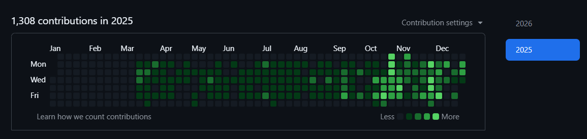

# Abhinav Anand

**Full Stack Engineer | Backend-focused (Django)**

---

### About
As a Software Engineer, I have developed, debugged, and tested multiple dynamic, real-time systems, including **E-commerce**, **Blog**, and **Vendor Management** platforms.

---

### Currently Building
Scalable backend services and REST APIs using **Django**, **Django REST Framework**, and **PostgreSQL**.

---

### Core Stack

  
  
  
  
  
  

---

### Additional Experience

  
  
  
  
  
  
  
  
  

---

### GitHub Contributions From Company Profile

---

### GitHub Stats

### Profile Views

---

### Featured Projects

<a href="http://abhinav7.pythonanywhere.com/portfolio">

**Portfolio Webapp**
`Python` `Django`
Personal portfolio showcasing projects with detailed descriptions and live demos.

</a>

---

<a href="http://abhinav7.pythonanywhere.com/blog">

**Blog Webapp**
`Python` `Django` `Selenium`
Secure, scalable blog platform with authentication, posts, likes, comments, and follow system.

</a>

---

<a href="http://abhinav7.pythonanywhere.com/ecommerce">

**E-commerce Webapp**
`Python` `Django` `Selenium`
Full-featured e-commerce system with search, cart, wishlist, orders, and admin management.

</a>

---

<a href="http://abhinav7.pythonanywhere.com/restaurant">

**Restaurant Webapp & REST API**
`Django` `Django REST Framework`
RESTful system with token-based auth, menu browsing, table booking, and order placement.

</a>

---

<a href="http://abhinav7.pythonanywhere.com/vendor-management">

**Vendor Management REST API**
`Django` `Django REST Framework`
Secure API for vendor onboarding, order workflows, and performance metrics tracking.

</a>

---

### Connect With Me
- 💼 LinkedIn: [abhinavanand7](https://www.linkedin.com/in/abhinavanand7/)
- 🌐 Portfolio: [abhinav7.pythonanywhere.com](http://abhinav7.pythonanywhere.com/)

---

From [abhinavfu](https://github.com/abhinavfu)

